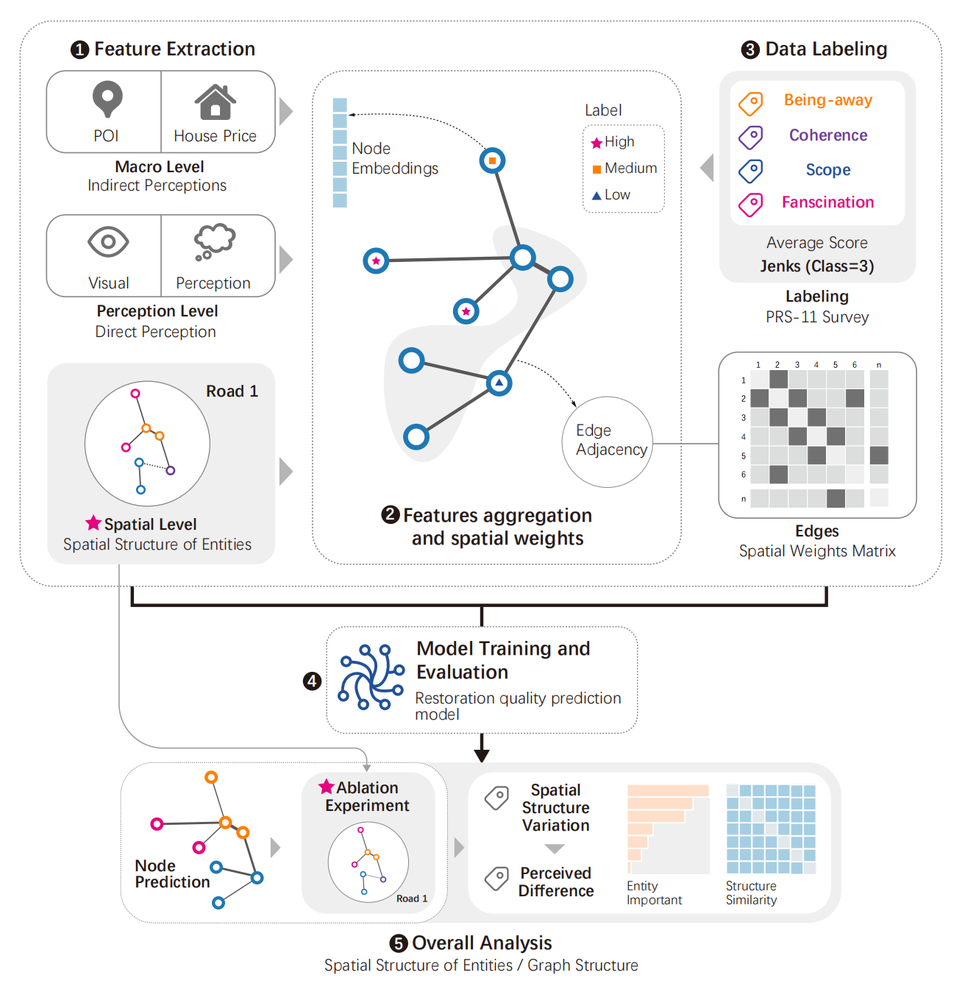

# Restoration_Topology_Graph
Our research is divided into 5 parts. Parts 1, 2, 3, and 4 involve constructing a semi-supervised graph neural network and training it (including Feature extraction, Feature embedding, Data labeling, and Model training). Part 5 involves analyzing the final results and conducting ablative experiments by treating spatial structural features as control variables to explore the impact of spatial structural heterogeneity on restorative quality.

